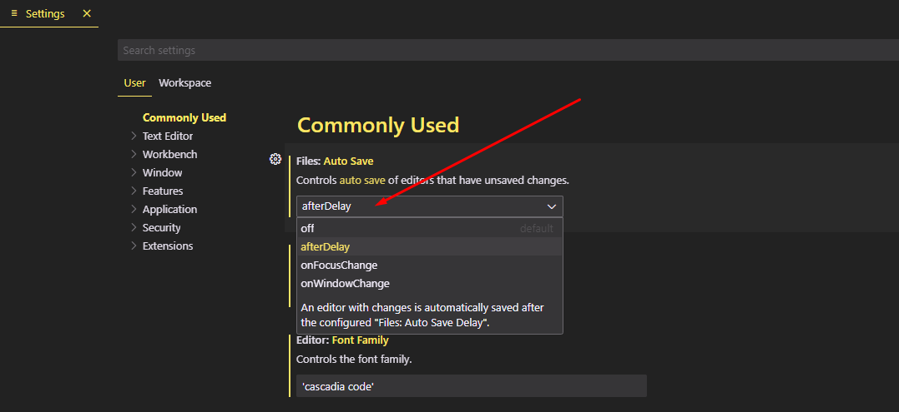
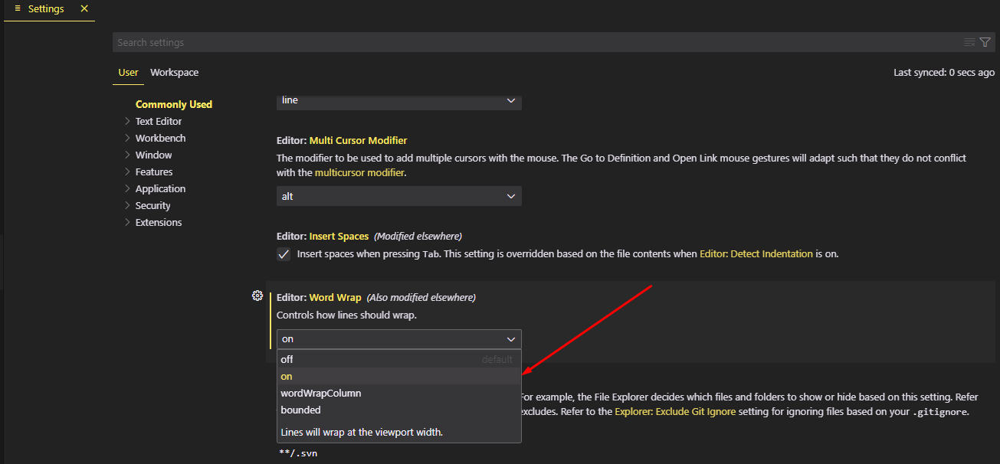
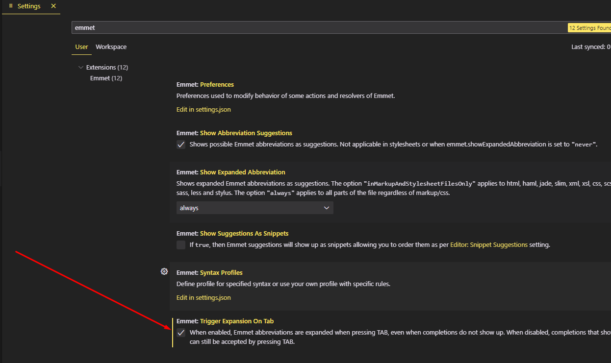

# Vs code extension for working with web design

How i organize my vscode

## List of extensions:

⚡️ Auto Close Tag -> it's auto complete the closing tag

⚡️Auto Rename Tag -> if make any change in your tag it will change the tag

⚡️indent-rainbow -> for better spacing

⚡️Live Server -> for watching your code in browser in real time

⚡️Path Autocomplete -> for suggest available path of folders or file

⚡️Image preview -> for image preview

⚡️Better Comments -> for better comments visibility

⚡️Dracula Official | Monokai Pro -> look for your vs code (themes)

⚡️CodeSnap -> for cool screenshot

⚡️Markdown Preview Github Styling -> preview markdown .md file

⚡️Bootstrap 5 Quick Snippets -> Bootstrap components shortcut

⚡️Tabnine Al Autocomplete -> for autocomplete and ai base suggestion cool extensions

⚡️PHP DEVSENSE -> For PHP ultimate suggestion extensions

## Vs code settings (you should change)

### Auto save

### Word wrap

### Emmet suggestion

